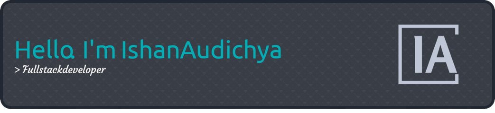

<!-- <h2 align='center'>Ishan Audichya</h2>

<b>UnderGrad at Vellore Institute of Technology, Vellore</b>
 -->

<h2>Heyoo 👋</h2>

 

 
- <i>Currently:</i> CS student at Vellore Institute of Technology. 

<h2>💻 I'm Currently working on</h2>

- FrontEnd Web Development
- Fullstack Development
- Data Science
- AWS Certification
 
Do check out my GitHub repository:

<h2> About Audichya⚡:</h2>

I'm a UnderGraduate Student studying in Vellore, TamilNadu. Outside Tech, I love to read, enjoy music and explore nature outdoors. If you are around, drop an email and let's catch-up over Coffee!

<h3 align="left">Languages and Tools:</h3>

                   

<h3 align="left">Support Me UwU :</h3>

    

&nbsp;   
 

